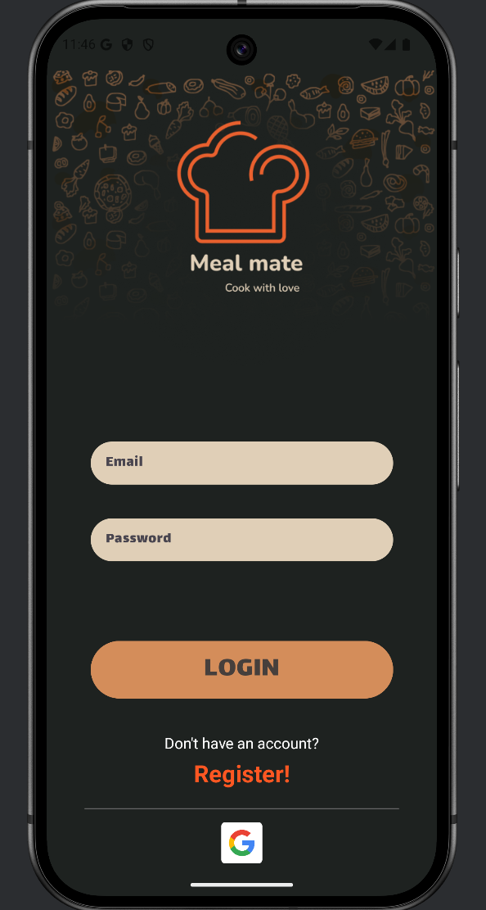
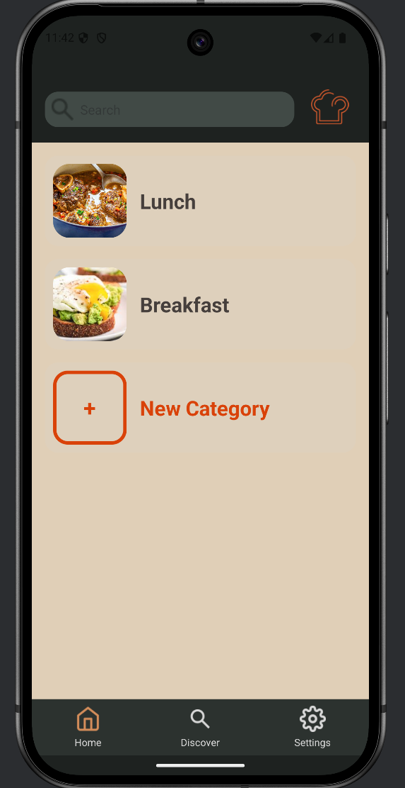
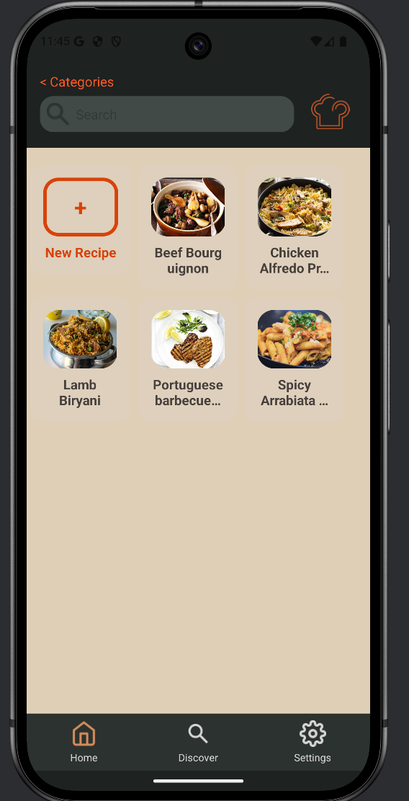
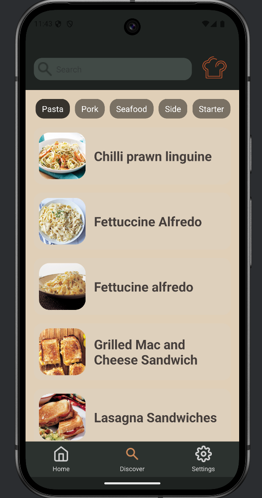
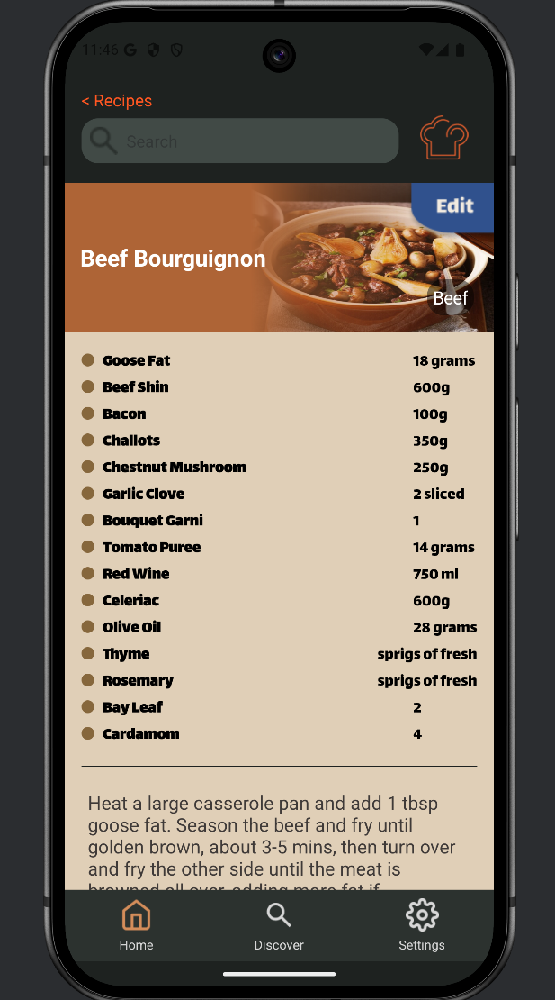

# Meal Mate
Meal mate is a recipe app that allows users to create and save recipies from a large database of  
recipies from MealDB API. The app allows users to either get inspired by the recipies from the  
database or create their own recipies and save them for future reference.

## Features
### User Authentication
- Users can sign up and log in to the app using their email and password.
- Users can also sign in using their Google account.
- Each user has their own profile page where they can view their saved recipies.

### Categories
- Users can create categories to organize their recipies.
- Users can add recipies to categories.  

example categories: Breakfast, Lunch, Dinner, Burgers, Pizza, etc.

### Recipies
- Users can create recipies and add them to a category.
- Users can view, edit and delete recipies.
- Users can search for recipies using the search bar.
Recipies contain the following information:
- Title
- Photo
- Ingredients
- Instructions
- Tag : Beef, Chicken, Pasta, etc.

### Explore Page
- Users can view a list of recipies from a large database of recipies.
- Users can search for recipies using the search bar.
- Users can view the details of a recipie by clicking on it.
- Users can save a recipie in a certain category.

# Tehnical Details
## Storage
### Firebase
It uses the firestore database in order to store the users data and the recipies.  
The data is stored in the following structure:

<pre style="background-color: #1E1E1E; color: #D4D4D4; padding: 10px; border-radius: 5px; font-family: Consolas, monospace;">
users/
  userId/
    categories/
      categoryId/
        categoryName: String
        recipes/
          recipeId/
            ingredientTitle: String
            ingredients: Array of { name: String, quantity: String }
            instructions: String
</pre>

### Drive
Because the firebase storage is no longer free, I decided to store the user's images in their Google Drive account.
The app uses the Google Drive API to upload and download images from the user's Google Drive account.

<pre style="background-color: #1E1E1E; color: #D4D4D4; padding: 10px; border-radius: 5px; font-family: Consolas, monospace;">
MealMate (folder)
  userId (from Firestore)/
    profile_picture.png
    categoryId (from Firestore)/
      category_picture.png
      recipeId (from Firestore)/
        recipe_picture.png
</pre>

# Screenshots

## Bibliography

1. **Android Studio**  
   JetBrains & Google. *Android Studio: The Official IDE for Android Development.*  
   Available at: [https://developer.android.com/studio](https://developer.android.com/studio)

2. **GitLab**  
   GitLab Inc. *GitLab: DevSecOps Platform for Source Code Management and CI/CD.*  
   Available at: [https://gitlab.com](https://gitlab.com)

3. **GitHub**  
   GitHub Inc. *GitHub: A Platform for Hosting and Reviewing Code.*  
   Available at: [https://github.com](https://github.com)

4. **Sourcetree**  
   Atlassian. *Sourcetree: A Git GUI for Managing Repositories.*  
   Available at: [https://www.sourcetreeapp.com](https://www.sourcetreeapp.com)

5. **Firebase**  
   Google. *Firebase: Build Better Apps with Backend Services.*  
   Available at: [https://firebase.google.com](https://firebase.google.com)

6. **Google Drive API**  
   Google. *Google Drive API: Access and Manage Google Drive Files.*  
   Available at: [https://developers.google.com/drive](https://developers.google.com/drive)

7. **TheMealDB API**  
   TheMealDB. *TheMealDB API: Open Database of Recipes and Meals.*  
   Available at: [https://www.themealdb.com](https://www.themealdb.com)
